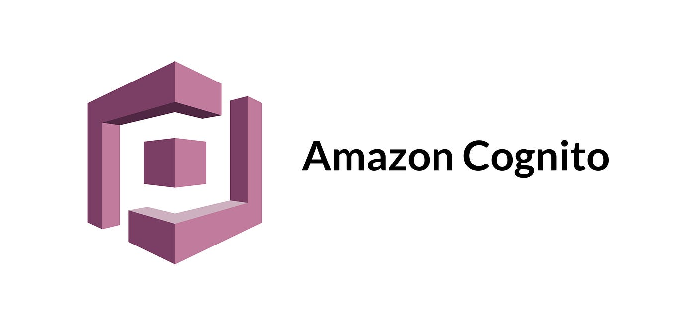
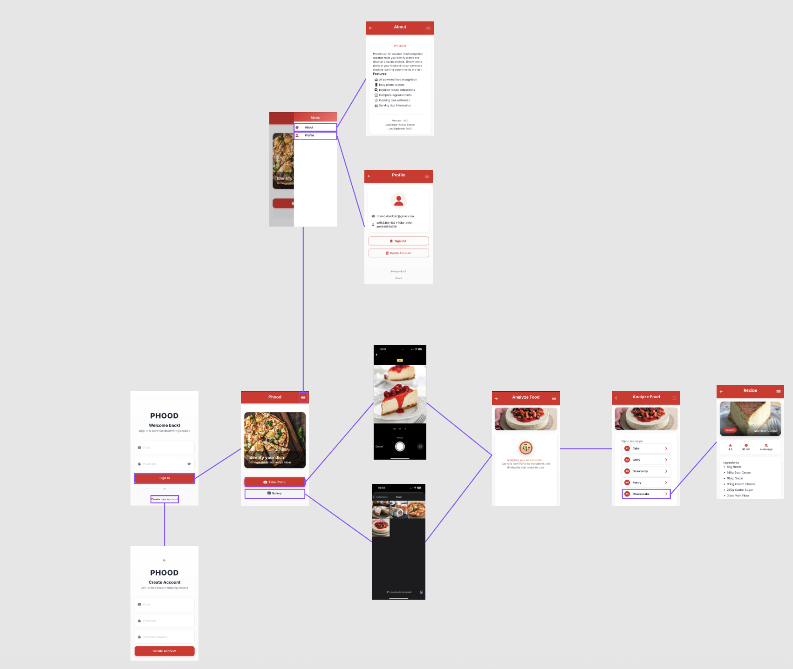

# Phood - AI Food Recognition App

## Introduction

**Phood** is an innovative mobile application that combines artificial intelligence with culinary passion. The app allows users to automatically identify foods through photographs and obtain detailed recipes in real-time.

The application has been developed using modern technologies to ensure a smooth and intuitive user experience, offering advanced food recognition features through AI.

## Description

Phood transforms the way we interact with food through technology:

- **AI Recognition**: Take a photo of your dish and the AI will automatically identify the ingredients
- **Instant Recipes**: Receive complete recipes with ingredients, measurements, and step-by-step instructions
- **Secure Authentication**: Protected login system with AWS Cognito
- **Responsive Design**: Interface optimized for mobile devices
- **Optimized Performance**: Fast loading and intelligent caching

The application is designed to be used by both expert chefs and cooking beginners, offering a personalized and accessible experience.

## Technologies Used

### Frontend Framework
<div align="left">
  
  
</div>

- **React 19.0.0**: Modern JavaScript framework for building interactive user interfaces
- **TypeScript 5.1.6**: Typed language that extends JavaScript for more robust and maintainable code
- **Ionic React 8.5.0**: Framework for cross-platform hybrid application development
- **React Router 5.3.4**: Routing management and navigation between application pages

### Build Tools & Development
- **Vite 5.2.0**: Modern and fast build tool for frontend development
- **@vitejs/plugin-react**: Plugin for React integration with Vite
- **@vitejs/plugin-legacy**: Legacy browser support

### Styling & UI
- **Styled Components 6.1.19**: CSS-in-JS for styled and reusable components
- **Ionicons 7.4.0**: Vector icon library for user interface

## Third-Party Technologies

### Cloud & Authentication
<div align="left">
  
</div>

- **[AWS Cognito](https://aws.amazon.com/cognito/)**: User authentication and management service
  - Secure user account management
  - Multi-factor authentication
  - Integration with AWS Amplify for React
- **AWS Amplify 6.15.5**: Framework for full-stack application development
- **Amazon Cognito Identity Provider**: Advanced identity management

### AI & Machine Learning
<div align="left">
  
</div>

- **[Clarifai API](https://www.clarifai.com/)**: Artificial intelligence platform for image recognition
  - Specialized model for food recognition
  - Real-time image analysis
  - Return of concepts with confidence levels

### Mobile Development
<div align="left">
  
</div>

- **[Capacitor 7.4.2](https://capacitorjs.com/)**: Framework for native app development
  - **@capacitor/camera**: Device camera access
  - **@capacitor/filesystem**: Local file management
  - **@capacitor/preferences**: User preferences storage
  - **@capacitor/haptics**: Tactile feedback
  - **@capacitor/status-bar**: Status bar management
  - **@capacitor/keyboard**: Virtual keyboard management

### Recipe Database
<div align="left">
  
</div>

- **[TheMealDB API](https://www.themealdb.com/)**: Free international recipe database
  - Over 500+ recipes from around the world
  - Detailed ingredients with precise measurements
  - Step-by-step instructions
  - Nutritional information and categories

### Utility Libraries
- **base-64**: Base64 encoding and decoding for images
- **react-router-dom**: Advanced routing for React

## Main Features

### Secure Authentication
- Registration and login with AWS Cognito
- Secure user session management
- Protected route authentication

### AI Recognition
- Integrated photo capture
- Gallery selection
- Real-time AI analysis
- Multiple ingredient identification

### Recipe System
- Automatic search based on identified ingredients
- Complete recipes with precise measurements
- Detailed step-by-step instructions
- Information about cuisine of origin

### Intelligent Cache
- Analysis results storage
- Avoids re-analysis of identical images
- Performance improvement

## Compatibility

- **iOS**: 14.0+
- **Android**: API Level 21+
- **Web**: Modern browsers (Chrome 79+, Firefox 70+, Safari 14+)

## Installation

```bash
# Clone the repository
git clone [repository-url]
cd phood-capacitor

# Install dependencies
npm install

# Configure environment variables
cp .env.example .env
# Edit .env with your credentials

# Start in development mode
npm run dev

# Build for production
npm run build

# Sync with Capacitor
npm run sync
```

## Technical Features

- **Architecture**: Single Page Application (SPA)
- **Pattern**: Component-based with React Hooks
- **State Management**: React useState/useEffect
- **Routing**: React Router with route protection
- **Styling**: CSS Modules + Styled Components
- **Build**: Vite with production optimizations
- **Deployment**: Capacitor for native apps

## License

This project is under MIT license. See the `LICENSE` file for more details.

## Contributing

Contributions are welcome! Please read the contribution guidelines before submitting a pull request.

## Workflow

<div align="center">
  
  
</div>

---
