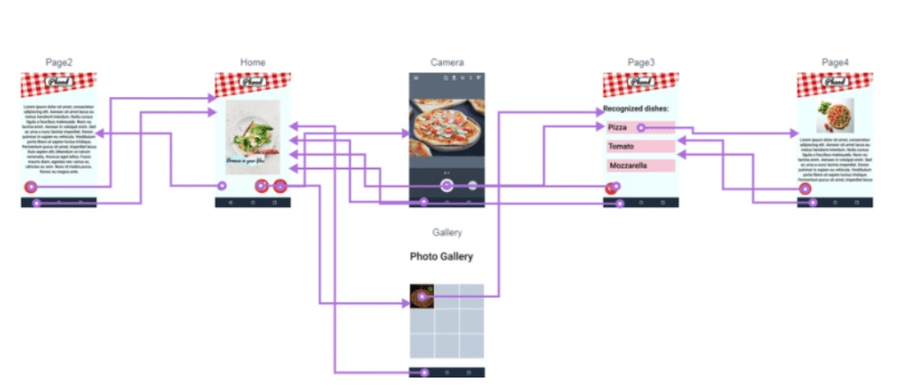
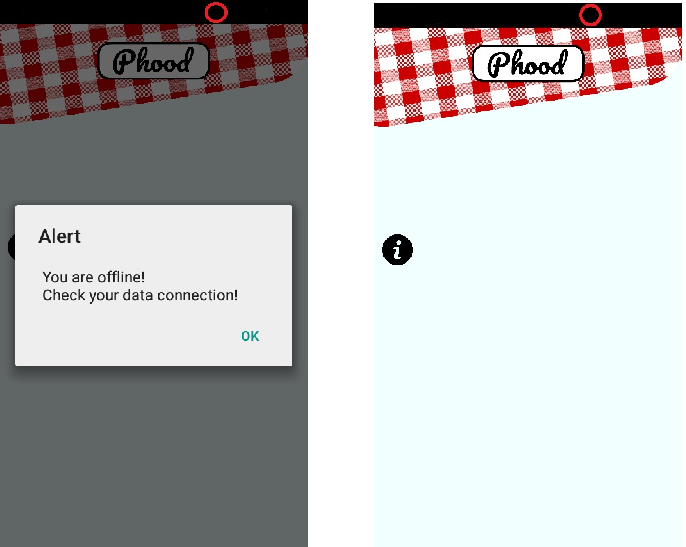
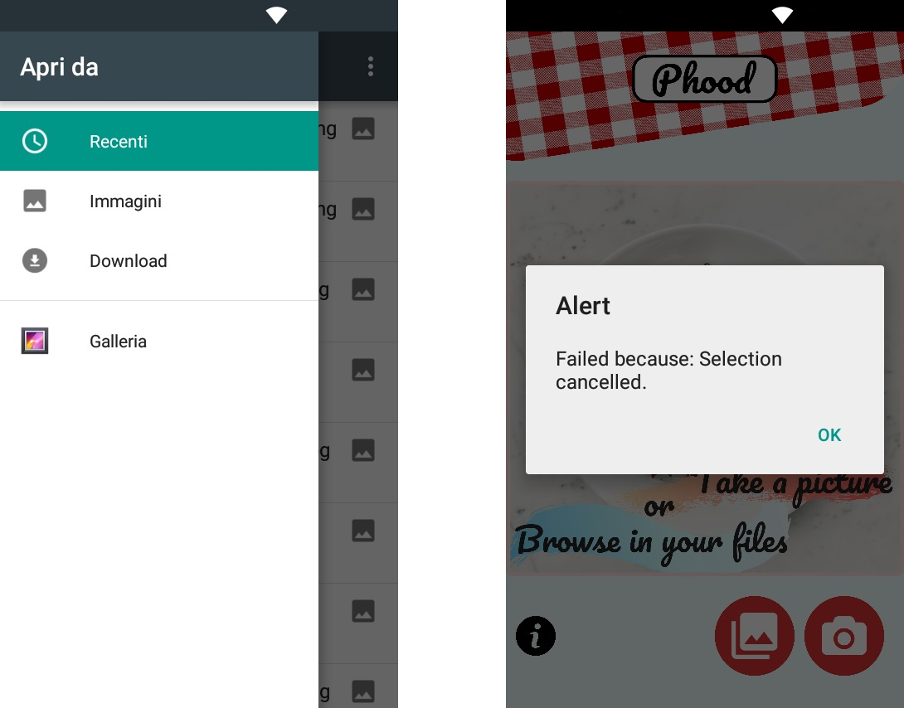

# App-Phood
Android application to recognize dishes through photo and get recipe.

<h2> Introduction </h2>
The purpose of the project is to create an application for Android devices.
The application works thank to the computer vision system, it allows to recognize, by a photo, the type of dish, and it provides the recipe to make it. This application is designed for users who love cook and they need to identify the type of dish or the ingredients present in it in a simple and fast way.
You can take a picture, or you can browse the photogallery and you will get all information, such as the ingredients and the recipe to cook the dish.
The application used several APIs for various purposes, for example the APIs offered by Apache Cordova framework were used to interfacing to the device components, such as the camera and the connection status of the device, the Clarifai APIs were used for the computer vision elaboration.

<h2> Description</h2>
To create this app I used Apache Cordova framework combine with Javascript.
I also used PhoneGap to inizialize the project and to link plugins for phone components.

For computer vision I used API from Clarifai link: https://www.clarifai.com/  
For the database recipe I used another API called TheMealDB link: https://www.themealdb.com/  
 

<h2> Images </h2>

 
Prototype wireframe app
 

Application running. Capture photo
 

Application running. Selected photo from photo gallery
 

Check connection status
 

Photo selection control
