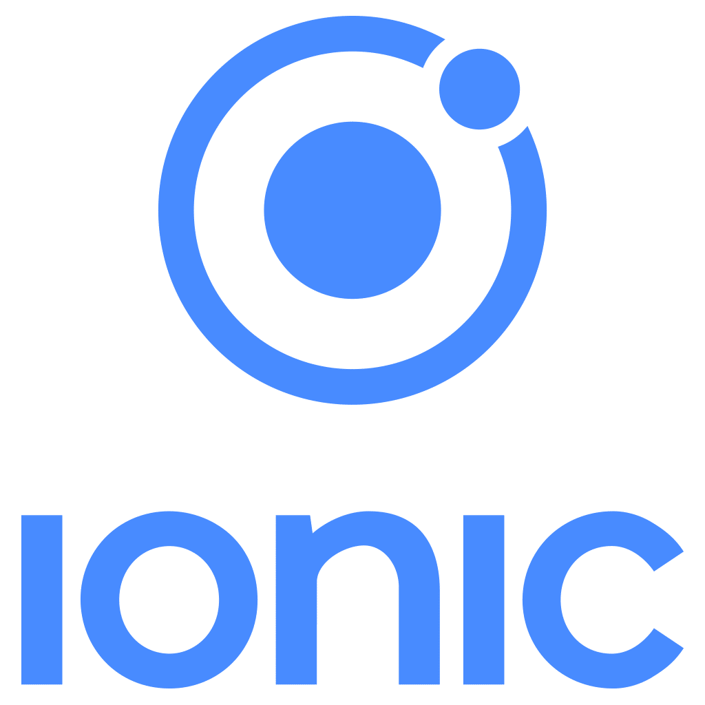

# Phood - AI Food Recognition App

## Introduction

**Phood** is an innovative mobile application that combines artificial intelligence with culinary passion. The app allows users to automatically identify foods through photographs and obtain detailed recipes in real-time.

The application has been developed using modern technologies to ensure a smooth and intuitive user experience, offering advanced food recognition features through AI.


## Description

Phood transforms the way we interact with food through technology:

- **AI Recognition**: Take a photo of your dish and the AI will automatically identify the ingredients
- **Instant Recipes**: Receive complete recipes with ingredients, measurements, and step-by-step instructions
- **Secure Authentication**: Protected login system with AWS Cognito
- **Responsive Design**: Interface optimized for mobile devices
- **Optimized Performance**: Fast loading and intelligent caching

The application is designed to be used by both expert chefs and cooking beginners, offering a personalized and accessible experience.

### Technologies Used

#### Frontend Framework  
<div align="left">
  
  
</div>

- **React : Modern JavaScript framework for building interactive user interfaces  
- **Ionic: Framework for cross-platform hybrid application development  

#### Third-Party Technologies

##### Cloud & Authentication  
<div align="left">
  
</div>

- **[AWS Cognito](https://aws.amazon.com/cognito/)**: User authentication and management service  

##### AI & Machine Learning  
<div align="left">
  
</div>

- **[Clarifai API](https://www.clarifai.com/)**: Artificial intelligence platform for image recognition  

##### Mobile Development  
<div align="left">
  
</div>

- **[Capacitor 7.4.2](https://capacitorjs.com/)**: Framework for native app development

##### Recipe Database  
<div align="left">
  
</div>

- **[TheMealDB API](https://www.themealdb.com/)**: Free international recipe database   

### Getting start 

```bash
# Clone the repository
git clone [repository-url]
cd phood-capacitor

# Install dependencies
npm install

# Configure environment variables
cp .env.example .env
# Edit .env with your credentials

# Start in development mode
npm run dev

# Build for production
npm run build

# Sync with Capacitor
npm run sync
```

## Deploy
<div align="left">
  
</div>
<a href="https://ionic.io/appflow" target="_blank" rel="noopener noreferrer">Ionic Appflow</a> is a cloud-based DevOps platform for Ionic apps. It simplifies development with automated builds, live updates, and easy app store deployment, helping you release faster and keep your apps up-to-date across all platforms.
<br/> <br/>
1. Go to Ionic Appflow sign up with GitHub, and connect your repository.  
2. Select the last commit or the branch you want to build from.  
3. Add environment variables as defined in your `.env` file.  
4. Upload your Android keystore for signing the APK.  
5. Configure the build settings and select Android APK build.  
6. Start the build and download the generated APK once completed.


## Userflow
<div align="center">
<table>
  <tr>
    <td></td>
    <td></td>
  </tr>
</table>
</div>


---
