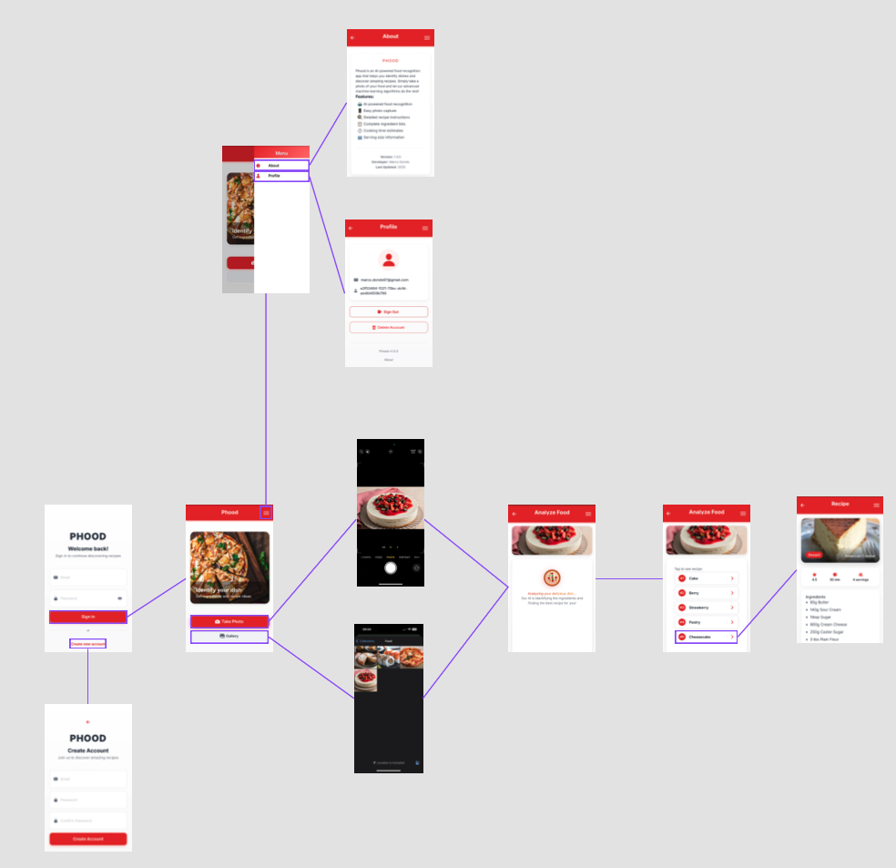

# Phood

## Introduction

**Phood** is a mobile app that uses artificial intelligence to identify foods from photos and instantly provide detailed recipes. Built with modern technologies, it delivers a fast, intuitive, and reliable user experience focused on advanced AI-powered food recognition.


## Description

**Phood** revolutionizes the way you engage with food using cutting-edge technology:

- **AI Recognition**: Snap a photo and let the AI identify your dish and ingredients  
- **Instant Recipes**: Get complete recipes with measurements and step-by-step instructions  
- **Secure Login**: Safe authentication powered by Amazon Cognito  
- **Mobile-First Design**: Optimized for a seamless experience on any device  

Designed for both seasoned chefs and beginners, Phood makes cooking smarter, faster, and more accessible.

### Technologies Used

#### Frontend Framework  
<div align="left">
  
  
</div>

- **React**: Modern JavaScript framework for building interactive user interfaces  
- **Ionic**: Framework for cross-platform hybrid application development  

#### Third-Party Technologies

- **[Amazon Cognito](https://aws.amazon.com/cognito/)**: User authentication and management service  
- **[Capacitor 7.4.2](https://capacitorjs.com/)**: Framework for native app development
- **[Clarifai API](https://www.clarifai.com/)**: Artificial intelligence platform for image recognition  
- **[TheMealDB API](https://www.themealdb.com/)**: Free international recipe database

<div align="center">
  
</div>

### Getting start 

```bash
# Clone the repository
git clone [repository-url]
cd phood-capacitor

# Install dependencies
npm install

# Configure environment variables
cp .env.example .env
# Edit .env with your credentials

# Start in development mode
npm run dev

# Build for production
npm run build

# Sync with Capacitor
npm run sync
```

## Deploy
<div align="left">
  
</div>
<a href="https://ionic.io/appflow" target="_blank" rel="noopener noreferrer">Ionic Appflow</a> is a cloud DevOps platform for Ionic apps offering automated builds, live updates, and easy deployment to app stores.
<br/><br/>

1. Go to Ionic Appflow sign up with GitHub, and connect your repository.  
2. Select the last commit or the branch you want to build from.  
3. Add environment variables as defined in your `.env` file.  
4. Upload your Android keystore for signing the APK.  
5. Configure the build settings and select Android APK build.  
6. Start the build and download the generated APK once completed.


## Result
<div align="center">
<table>
  <tr>
    <td></td> 
    <td></td>   
  </tr>
</table>
</div>
